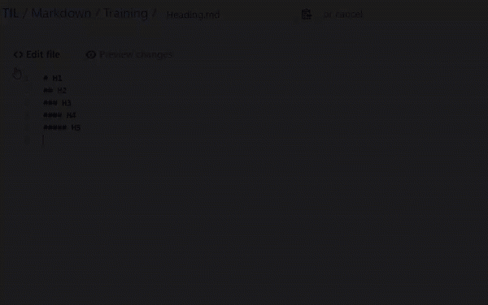
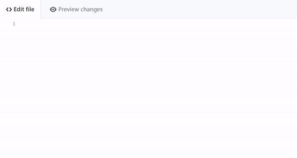
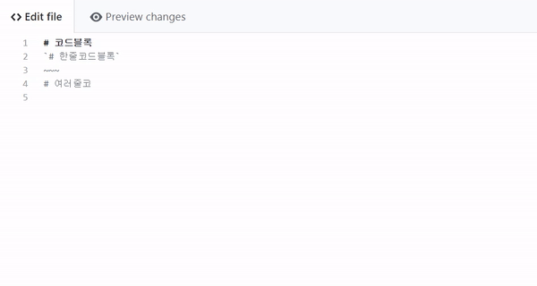
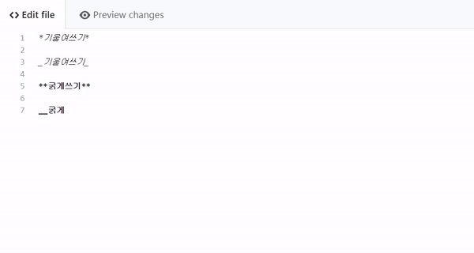
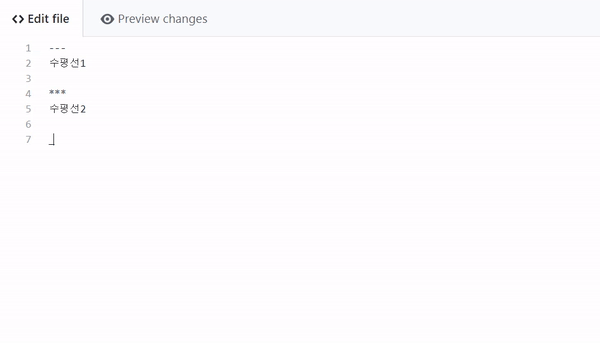
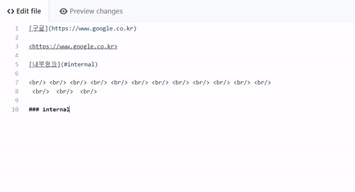

마크다운(MarkDown)
===

#### 마크다운 사용법정리 

* [제목(heading)](#heading)
* [인용(blockquotes)](#blockquotes)
* [코드블럭(Code Block)](#codeblock)
* [강조구문](#emphasis)
  * [기울여서 표시(italic)](#italic)
  * [진하게 표시(bold)](#bold)
  * [수평선 넣기](#horizontal)
* [링크](#link)
  * [인라인 링크](#inline link)
  * [참조 링크](#reference link)
  * [URI 링크](#URI link)
  * [내부 링크](#internal link)
* [리스트](#list)
  * [순서있는 리스트](#ordered list)
  * [순서없는 리스트](#unordered list)
* [테이블](#table)
* [이미지](#image)

### heading
` #으로 시작하는 텍스트. HTML 태그의 <h1> ~ <h6>과 같다. `

### blockquotes
`>로 시작하는 텍스트. 인용문을 쓸때 사용한다.`  

### codeblock
코드를 작성할 수 있는 구역을 지정해준다.
첫줄과 마지막줄에 ~~~ 를 삽입한다.

### inline code block
'(back quote)로 감싸진 텍스트.

### emphasis
* ### italic
  글씨가 기울여진다.
* ### bold
  글씨가 굵게 쓰여진다.  

### horizon
`-,*,- 3개를 이어서 작성한다. `  

### link
* ### 인라인 링크 
  `[링크하는곳을 나타내는 텍스트](링크url) `
  
* ### URI 링크
  `<링크 url> `
  
* ### 내부링크
  ` [링크하는 곳을 나타내는 텍스트](#id) `  
  ` 문서내에서 id를 갖고 있는 곳으로 이동한다. `  
  ` ### id `  
  ` id를 찾아서 이동한다. `  

  

    
### list
* ### 순서있는 리스트
  숫자. 을 사용하면 순서가 자동으로 만들어집니다  
  ` 1.1번 목록 `  
  ` 2.2번 목록 `  
  ` 3.3번 목록 `  

* ### 순서없는 리스트
  ` *,+,-로 시작합니다 `  
  ` * 목록1`  
    ` * 목록의 목록`  

### table
테이블을 만든다.
`Header1|Header2`  
`-------|------- 헤더와 컨텐트 부분을 나눈다.`  
`Content|Content`  
`Content|Content`  

### image
* ### 인라인 이미지 
 ``

* ### 링크 이미지
  ``
 
* ### 참조 이미지
  `![이미지를 나타내는 텍스트][1]`  
  `[1]:이미지 링크`  
